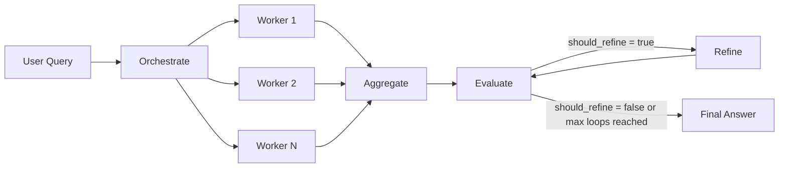
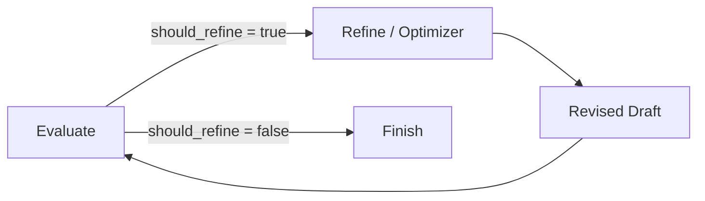
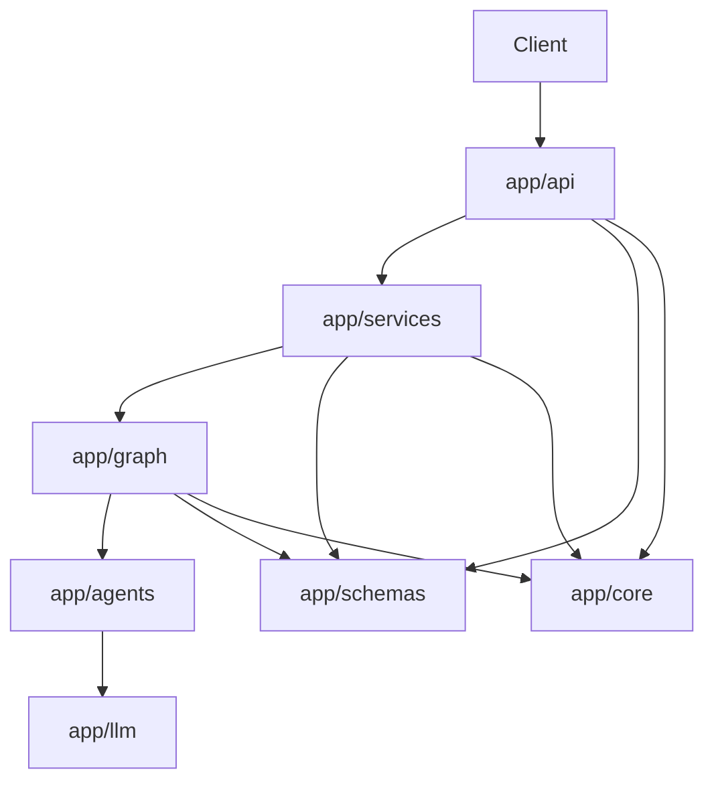

# LangGraph Agentic Orchestration

This project turns the user request into a structured plan instead of producing one long, unfocused answer in a single call. It splits work into independent subtasks, runs them with parallel worker calls, merges the outputs into one draft, and runs quality control. If needed, it runs another refine loop based on the evaluation.

In short, the system aims to:

- break complex user requests into manageable subtasks,
- widen coverage with parallel generation while keeping the answer disciplined,
- produce output that is easier to trace and audit than a single model reply,
- re-measure quality with explicit criteria instead of stopping at “an answer was produced.”

This repository is a good fit for:

- comparative analyses across countries, markets, companies, products, or themes,
- strategy and research work where one question splits into independent sections,
- knowledge workflows that need a draft plus critical review,
- teams learning agent orchestration, evaluator–refiner loops, and LangGraph state design.

## Architectural rationale

A “single prompt, single answer” approach works for simple tasks; as scope grows, you often see:

- the model juggling too many topics at once,
- important subtopics missing,
- redundant repetition in the answer,
- no visibility into why a part was produced or where it broke,
- quality control left vague at the prompt level.

The architecture here targets those issues directly:

1. The orchestrator turns the user request into a structured plan.
2. Workers run independent tasks from that plan in parallel.
3. The aggregator merges pieces into one readable draft.
4. The evaluator scores the draft against explicit quality criteria.
5. The optimizer produces revisions only when truly needed.

Cost and latency can increase; in return, the output is more consistent, the flow easier to read, and the system easier to extend. In production, the real win is not “more text” but a controllable decision flow.

## System overview

The app runs as a FastAPI service. The main entry point is the `POST /analyze` endpoint. It accepts a user query, optional execution settings, and returns the full workflow result:

- structured plan,
- generated worker tasks,
- each worker’s structured output,
- merged first draft,
- evaluation result,
- final improved text,
- execution metadata and timing.

The response carries not only the final text but how it was produced. That matters for observability: users and developers can answer not only “what did the system say?” but “which steps led to that result?”

## Architecture flow

The overall flow:

`START -> orchestrate -> worker fan-out -> aggregate -> evaluate -> refine loop -> END`




In more detail:

1. `orchestrate`
   The user query becomes an `OrchestrationPlan` with summary, decomposition rationale, and worker tasks.
2. `worker`
   Each task becomes an independent worker invocation via LangGraph’s `Send` mechanism. This is the fan-out step.
3. `aggregate`
   All worker outputs are collected fan-in style and turned into one draft answer.
4. `evaluate`
   The draft goes through structured quality scoring.
5. `refine`
   If the evaluator returns `should_refine = true` and the loop limit allows, the draft is revised.
6. `evaluate`
   The revised draft is evaluated again.
7. `END`
   The flow stops when no further improvement is needed or the maximum refine limit is reached.

This is close to classic map-reduce thinking:

- map: distribute tasks to parallel workers,
- reduce: merge results into one answer,
- critique loop: re-evaluate the text and fix it if needed.

You can picture the roles simply as:

- `orchestrator`: “How should I split this question?”
- `worker`: “Solve only the subtask I was given.”
- `aggregator`: “Turn these pieces into one coherent answer.”
- `evaluator`: “Is this good enough; where is it weak?”
- `optimizer/refine`: “Fix the draft according to what the evaluator said.”

## How the components work

### Orchestrator

The orchestrator keeps the user query from staying raw text and puts the system on an executable plan. The plan carries at least:

- what this request is asking for, in brief,
- why it should be split this way,
- which independent tasks can run in parallel,
- each task’s objective, scope, and expected output.

This layer is critical for quality. A bad decomposition weakens everything downstream. Orchestrator output is therefore not free-form text but a structured model validated with Pydantic.

If the model returns no tasks, the flow does not halt entirely: at least one best-effort fallback task is produced.

### Workers

Each worker runs only in its assigned task context. The goal is to stop one model call from owning the whole question and drifting across topics.

Each worker produces structured output of the form:

- `key_points`
- `analysis`
- `caveats`
- `confidence`

That gives two benefits:

- the aggregator receives consistent pieces instead of a pile of unstructured text,
- even on failure, worker output keeps a defined contract.

If a worker call fails, the whole run is not dropped immediately. Instead a `WorkerResult` is created for that task with error information—important for partial failures.

### Aggregator

The aggregator builds one human-readable draft from worker outputs. It is not only concatenation. It mainly:

- reduces repetition,
- trims unnecessary overlap,
- preserves differences between tasks,
- turns piecewise generation into one coherent narrative.

If this layer is weak, the output looks like “several mini answers pasted together.” The aggregator is therefore one of the main drivers of perceived quality in a multi-agent setup.

### Evaluator

The evaluator inspects the draft with a structured quality schema, not a subjective gloss. The key idea: the quality decision should be a machine-carried object, not loose prose.

Evaluation can surface signals such as:

- missing information,
- redundant phrasing,
- weak reasoning,
- unsupported claims,
- structure or flow issues,
- whether improvement is needed.

That makes the refinement loop controllable. The system decides on concrete fields and a `should_refine` flag, not vague “it could be a bit better” prompt intuition.

### Optimizer / Refine

When the evaluator says improvement is needed, the optimizer runs. It takes the current draft and evaluator feedback together and produces a revised answer.




This step is not left in an infinite loop. For each request:

- current iteration count,
- allowed maximum refine count

are kept in state. When `refinement_iteration < max_refinement_loops` is no longer satisfied, the flow ends.

Without that bound, evaluator and optimizer could trigger each other in an expensive, unstable loop.

## LangGraph and state

The project uses LangGraph’s `StateGraph`. The state schema is defined with `TypedDict`, and fields that need parallel merging use reducer logic.

Notable choices:

- The `worker_results` field merges with the `operator.add` reducer so parallel worker branches append to the same list without overwriting each other.
- `node_timings_ms` merges with a custom merge reducer; each node writes its own timing into state.
- API and LLM structured outputs are modeled with Pydantic; graph `state` stays `TypedDict`—in practice, that pairing is faster for parallel merges.

This is a deliberate trade-off: you could move all of graph state into Pydantic, but `TypedDict` + reducers usually yield a larger speed gain where parallel branches meet.

In one line each:

- `Pydantic` answers “is the payload shape correct?” for APIs and LLM outputs.
- `TypedDict + reducer` answers “how do we merge data from parallel steps?” more practically.

## Layers

The codebase is organized into these directories:

| Layer          | Responsibility                                                                           |
| -------------- | ---------------------------------------------------------------------------------------- |
| `app/api`      | HTTP routes, wiring services with FastAPI `Depends`, `trace_id` per request              |
| `app/services` | Runs the graph, maps results to the API response model                                  |
| `app/graph`    | LangGraph nodes, state definition, conditional edges                                     |
| `app/agents`   | Orchestrator, worker, aggregator, evaluator, optimizer calls and prompts                 |
| `app/llm`      | OpenAI access, timeouts, retries, structured output boundaries                           |
| `app/schemas`  | Pydantic models                                                                          |
| `app/core`     | Environment variables, logging, app settings                                             |


The main benefit is separation: framework concerns and LLM behavior stay apart from workflow logic. The API layer is FastAPI-specific; graph nodes can be reasoned about without HTTP.



## Code walkthrough

This aligns the high-level architecture with the real call chain in the repo; the goal is to show the path from request to response, not to paste every file verbatim.

### `routes.py`: HTTP entry

The `POST /analyze` endpoint in `app/api/routes.py` does not run business logic; it reads the body, generates or reads `trace_id`, and delegates to the service.


```python
@router.post("/analyze", response_model=AnalyzeResponse)
async def analyze(body: AnalyzeRequest, svc: AnalyzeService, trace_header: str | None):
    trace_id = trace_header or str(uuid.uuid4())
    return await svc.analyze(body, trace_id=trace_id)
```

The real file also uses FastAPI `Depends`, `bind_trace_id`, and `structlog` context—see `routes.py` for details.

### `analyze_service.py`: initial state and `ainvoke`

`AnalyzeService` turns the HTTP request into the initial `state` dict structure the graph expects and calls `ainvoke`.

```python
initial = {
    "trace_id": tid,
    "user_query": req.query,
    "max_refinement_loops": max_loops,
    "refinement_iteration": 0,
    "worker_tasks": [],
    "worker_results": [],
    "node_timings_ms": {},
    "model_name": model_name,
}

final = await self._graph.ainvoke(initial)
```

The service layer acts as an adapter between the API schema and graph `state`: per-request settings go into state, and after the graph finishes the result is mapped back to the API response model.

### `builder.py`: compiling the graph

In `app/graph/builder.py`, each logical step is registered with `add_node` first (with wrapper functions inside for orchestrate, worker, aggregate, evaluate, refine), then `START` and edges are wired.

```python
g.add_node("orchestrate", _orchestrate)
g.add_node("worker", _worker)
# ... aggregate, evaluate, refine

g.add_edge(START, "orchestrate")
g.add_conditional_edges("orchestrate", nodes.route_after_orchestrate)
g.add_edge("worker", "aggregate")
g.add_edge("aggregate", "evaluate")
g.add_conditional_edges("evaluate", nodes.route_after_evaluate)
g.add_edge("refine", "evaluate")
```

`route_after_orchestrate` does not return a single “next node”: orchestration failure can go to `END`, the happy path fans out to workers with `Send`, and zero tasks can skip straight to aggregate—see the router in `nodes.py` for full behavior.

Flow summary:

- `orchestrate` → conditional worker fan-out or `aggregate` / `END`
- worker outputs → `aggregate` → `evaluate`
- if needed, `refine` → `evaluate` again

The loop is not hidden in prompts; `evaluate` / `refine` wiring is visible in the graph definition.

### `nodes.py`: business rules

`nodes.py` holds workflow behavior; each node has a single responsibility.

```python
plan = await run_orchestrator(...)
tasks = _ensure_tasks(plan, user_query)
return {
    "plan": plan,
    "worker_tasks": tasks,
    "node_timings_ms": finish(),
}
```

The plan comes from the model, task list is normalized with `_ensure_tasks`, and results go to state plus timing in `node_timings_ms`.

On the worker side, each invocation handles one task:

```python
out = await run_worker(...)
result = WorkerResult(
    task_id=task.task_id,
    task_title=task.title,
    output=out,
    model=model,
    status="ok",
)
return {"worker_results": [result], "node_timings_ms": timing}
```

Each worker yields one `WorkerResult`; because `worker_results` merges with the `operator.add` reducer, parallel branches append safely to the same list.

### Aggregate, evaluate, and refine

Easy to confuse; in code they are distinct:

- `aggregate_node`: builds the first merged draft from worker results
- `evaluate_node`: inspects the draft and returns structured critique
- `refine_node`: revises the draft using evaluator feedback

```python
refined = await run_optimizer(
    llm=llm,
    user_query=user_query,
    draft=draft,
    evaluation=ev_model,
    model=model,
    trace_id=trace_id,
)
```

The optimizer does not generate from scratch from worker outputs; it revises `aggregate`’s `draft_answer` using evaluator feedback. Flow: `aggregate` → draft, `evaluate` → critique, `refine` → correction.

### The `node_timings_ms` field

A common field is `node_timings_ms`: per-node duration in milliseconds.

Example:

```json
{
  "orchestrate": 210.4,
  "worker:task_001": 640.1,
  "aggregate": 155.2,
  "evaluate": 102.8
}
```

That makes the slowest step and bottleneck (worker vs evaluator) easy to spot; it can also be exposed to the client via `execution`.

### Modular layout

Orchestration logic is not buried in prompts: routes, service, graph wiring, node logic, schemas, and LLM calls live in separate files. Adding a new step (e.g. a `fact_check` node) can be an explicit graph node rather than hiding behavior in the prompt layer.


## HTTP API

### `GET /health`

Expected response:

```json
{
  "status": "ok"
}
```

Example request:

```bash
curl http://localhost:8000/health
```

### `POST /analyze`


```json
{
  "query": "Analyze EV charging infrastructure investment opportunities across Turkey, Germany, and France",
  "settings": {
    "max_refinement_loops": 2,
    "model": "gpt-4o-mini"
  }
}
```

Example `curl` request:

```bash
curl -X POST http://localhost:8000/analyze \
  -H "Content-Type: application/json" \
  -H "x-request-id: demo-run-001" \
  -d '{
    "query": "Analyze EV charging infrastructure investment opportunities across Turkey, Germany, and France",
    "settings": {
      "max_refinement_loops": 2,
      "model": "gpt-4o-mini"
    }
  }'
```

Pipe through `jq` for readability:

```bash
curl -X POST http://localhost:8000/analyze \
  -H "Content-Type: application/json" \
  -d '{
    "query": "Compare startup investment conditions in Turkey, Germany, and France",
    "settings": {
      "max_refinement_loops": 1
    }
  }' | jq
```

#### Request fields

- `query`
  User query to analyze. Minimum 3 characters, maximum 16,000.
- `settings.max_refinement_loops`
  Overrides the default refine limit for this request. Allowed range `0..10`.
- `settings.model`
  Overrides the default OpenAI model for this request.

#### Response body

The response model includes:

- `plan`
  Decomposition plan from the orchestrator.
- `worker_tasks`
  List of tasks that ran.
- `worker_results`
  Structured output per task.
- `draft_answer`
  First merged draft after the aggregator.
- `evaluation`
  Evaluator result.
- `improved_final_answer`
  Exposure of graph state field `improved_answer` in the API; without refine, usually same as `draft_answer`.
- `execution`
  Execution metadata (`trace_id`, timings, iteration counts, etc.).

Example response skeleton:

```json
{
  "plan": {
    "summary": "Cross-country EV charging investment analysis",
    "decomposition_rationale": "Split by country to isolate regulatory and market differences",
    "tasks": [
      {
        "task_id": "task_001",
        "title": "Turkey analysis",
        "objective": "Assess the Turkish market",
        "scope": "Policy, demand, infrastructure, risks",
        "expected_output": "Structured country analysis"
      }
    ]
  },
  "worker_tasks": [],
  "worker_results": [],
  "draft_answer": "Initial synthesized answer",
  "evaluation": {
    "criteria": [],
    "overall_quality": 4,
    "missing_information": [],
    "redundancy_issues": [],
    "weak_reasoning": [],
    "unsupported_claims": [],
    "structure_issues": [],
    "recommended_improvements": [],
    "should_refine": false
  },
  "improved_final_answer": "Initial synthesized answer",
  "execution": {
    "trace_id": "8fcd2a8f-3da4-4f0f-bb09-2f86d5f7db33",
    "status": "completed",
    "refinement_iterations": 0,
    "max_refinement_loops": 2,
    "model": "gpt-4o-mini",
    "node_timings_ms": {
      "orchestrate": 210.4,
      "worker:task_001": 640.1,
      "aggregate": 155.2,
      "evaluate": 102.8
    },
    "total_duration_ms": 1218.5,
    "extra": {}
  }
}
```

## State fields

Each request starts from an initial `state`. Important fields:

- `trace_id`
- `user_query`
- `max_refinement_loops`
- `refinement_iteration`
- `worker_tasks`
- `worker_results`
- `draft_answer`
- `evaluation`
- `improved_answer` (returned as `improved_final_answer` in the HTTP response)
- `error`
- `error_stage`
- `node_timings_ms`
- `model_name`

This model supports both graph decisions and metadata returned to the API: you can see which stage failed, aggregate worker timings, and validate intermediate state in tests.

## Error handling

Instead of failing the whole request on every error, information is written to `state` whenever possible.

- On critical errors during orchestrator, aggregate, evaluate, or refine, `error` and `error_stage` are populated.
- Worker failures are recorded on the corresponding `WorkerResult`.
- The service layer summarizes the final status as `completed` or `failed`.
- Details may appear in `execution.extra`.

In production the goal is not only stack traces but how the failure surfaces to the user and in the `execution` payload.

<a id="izlenebilirlik"></a>

## Observability

Each call gets a `trace_id`. If the request includes `x-request-id` or `x-trace-id`, that value is used; otherwise a new UUID is generated.

Signals collected: `trace_id`, per-node `node_timings_ms`, `total_duration_ms`, refine count, model name, and error stage when present.

This is enough skeleton for basic debugging and latency analysis; for deeper needs, extend with OpenTelemetry, LangSmith, or an enterprise observability stack.

## Configuration and setup

### Environment variables

Settings load from `.env` and environment variables. Do not commit `OPENAI_API_KEY` or other secrets to the repo; use a local `.env` or a secure secret store.

| Variable                      | Description                                  | Default       |
| ----------------------------- | -------------------------------------------- | ------------- |
| `OPENAI_API_KEY`              | API key for LLM calls                        | empty         |
| `OPENAI_MODEL`                | Default model name                           | `gpt-4o-mini` |
| `OPENAI_TIMEOUT_SECONDS`      | Per-call timeout                             | `120.0`       |
| `LLM_MAX_RETRIES`             | Retry attempts                               | `3`           |
| `LLM_RETRY_MIN_WAIT_SECONDS`  | Minimum backoff for retries                  | `1.0`         |
| `LLM_RETRY_MAX_WAIT_SECONDS`  | Maximum backoff for retries                  | `30.0`        |
| `API_HOST`                    | FastAPI host                                 | `0.0.0.0`     |
| `API_PORT`                    | FastAPI port                                 | `8000`        |
| `LOG_LEVEL`                   | Log level                                    | `INFO`        |
| `LOG_JSON`                    | JSON log format                              | `false`       |

The code defaults `default_max_refinement_loops = 2`; the request body can override it.

### Requirements and running

- Python `3.12+`
- OpenAI API key

```bash
make install
cp .env.example .env
# Fill in OPENAI_API_KEY and other fields in .env
```

`make install` creates `.venv` and installs the package with dev dependencies.

```bash
make run
curl http://localhost:8000/health
```

## Lint and type checking

```bash
make lint
make typecheck
```

There is no automated test suite yet; quality relies on these two commands (`lint`: style and obvious issues; `typecheck`: types and contracts). Strong typing matters here because state-shape bugs often show up late and look like LLM misbehavior.

## Design decisions

### LangGraph

The problem is not a plain chain; fan-out, fan-in, and a refine loop read and evolve more clearly as a graph.

### OpenAI SDK and Pydantic

A thin layer instead of an extra chain framework: data flow stays visible, structured output boundaries stay clear, dependency surface stays small. Some conveniences are hand-written; for small-to-medium orchestration services that trade-off is usually sustainable.

### Evaluator–refiner loop

The first draft is rarely perfect; systematic evaluation improves scope and structure at the cost of money and latency—hence caps and conditional refine.

### Graph instead of one super prompt

A single giant prompt is tempting short term; on multi-faceted questions, traceability, testing, and tuning get harder. Graphs split steps into files and nodes.

## Limitations

This repo is an example and learning baseline; production would need more:

- no external tools—only model-based reasoning,
- no caching layer,
- no rate limiting or queueing,
- no authorization / authentication,
- no persistent audit store or tracing backend,
- no prompt versioning or A/B comparison machinery.

Do not treat it as ready for heavy production traffic without extra infrastructure, especially under high volume, cost control, or operational reliability requirements.


## Additional resources

- [LangGraph documentation](https://langchain-ai.github.io/langgraph/) — `StateGraph`, conditional edges, and execution model.
- [Map-reduce](https://langchain-ai.github.io/langgraph/how-tos/map-reduce/) — same mental model as worker fan-out and `aggregate`.
- [Building effective agents](https://www.anthropic.com/engineering/building-effective-agents) (Anthropic) — when a single call suffices vs a multi-step workflow; matches explicit graph nodes.
- [LLM Powered Autonomous Agents](https://lilianweng.github.io/posts/2023-06-23-agent/) (Lilian Weng) — planning and multi-step agent behavior at survey depth.
- [OpenAI Cookbook](https://github.com/openai/openai-cookbook) — API usage, structured output, and application examples.
