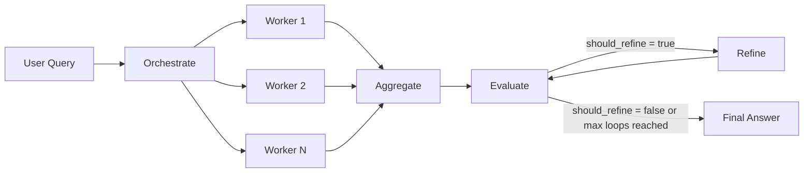
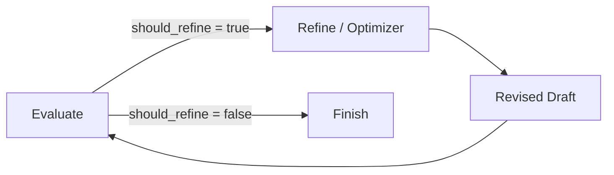
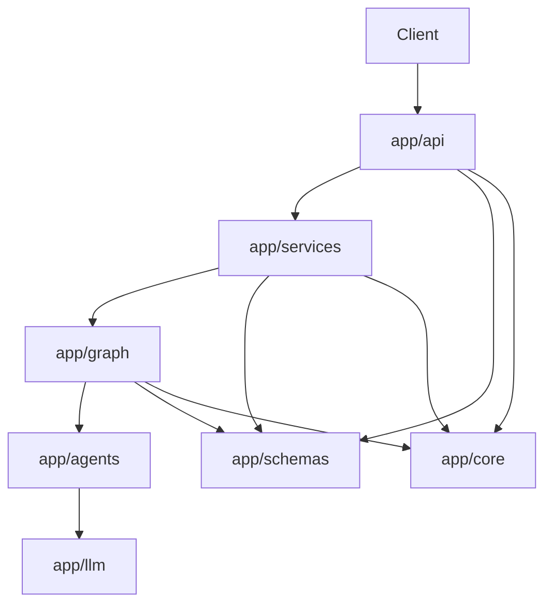

# LangGraph Agentic Orchestration

Bu proje, tek çağrıda uzun ve dağınık yanıt üretmek yerine kullanıcı isteğini önce yapılandırılmış bir plana çevirir, bağımsız alt görevlere böler, bu görevleri paralel worker çağrılarıyla işler, çıktıları tek taslağa birleştirir ve kalite kontrolünden geçirir. Gerekirse değerlendirme sonucuna göre bir refine döngüsü daha çalışır.

Kısa haliyle sistemin amacı şudur:

- karmaşık kullanıcı taleplerini daha yönetilebilir alt görevlere ayırmak,
- paralel üretim ile kapsamı genişletirken yanıt disiplinini korumak,
- tekil model cevabına kıyasla daha izlenebilir ve denetlenebilir bir çıktı üretmek,
- “cevap üretildi” ile yetinmeyip kaliteyi açık kriterlerle tekrar ölçmek.

Bu repo, özellikle aşağıdaki kullanım tipleri için uygundur:

- birden fazla ülke, pazar, şirket, ürün veya tema içeren karşılaştırmalı analizler,
- aynı sorunun bağımsız alt başlıklara ayrılabildiği strateji ve araştırma işleri,
- taslak oluşturma ve ardından eleştirel değerlendirme gerektiren bilgi üretim akışları,
- agent orchestration, evaluator-refiner loop ve LangGraph state tasarımı öğrenmek isteyen ekipler.

## Mimari gerekçesi

“Tek prompt, tek cevap” yaklaşımı basit işlerde iş görür; kapsam büyüyünce ise şu sorunlar sık görülür:

- model aynı anda çok fazla konuyu taşımaya çalışır,
- önemli alt başlıklar eksik kalır,
- cevap gereksiz tekrar üretir,
- hangi parçanın neden üretildiği ve nerede bozulduğu izlenemez,
- kalite kontrol mekanizması prompt seviyesinde belirsiz kalır.

Bu projede tercih edilen mimari bu sorunları doğrudan hedefler:

1. Orchestrator, kullanıcı isteğini yapılandırılmış bir plana dönüştürür.
2. Worker’lar, bu planın bağımsız görevlerini paralel yürütür.
3. Aggregator, parçaları tek bir okunabilir taslakta birleştirir.
4. Evaluator, ortaya çıkan taslağı açık kalite kriterleriyle değerlendirir.
5. Optimizer, yalnızca gerçekten gerekirse revizyon üretir.

Maliyet ve gecikme artabilir; karşılığında çıktı daha tutarlı, akış daha okunur ve genişletmesi kolaydır. Üretim tarafında asıl kazanç “daha çok metin” değil, kontrol edilebilir karar akışıdır.

## Sistem özeti

Uygulama bir FastAPI servisi olarak çalışır ve ana giriş noktası `POST /analyze` endpoint’idir. Bu endpoint bir kullanıcı sorgusu alır, isteğe bağlı yürütme ayarlarını kabul eder ve aşağıdaki bileşenlerden geçen tam iş akışının sonucunu döner:

- yapılandırılmış plan,
- oluşturulan worker görevleri,
- her worker’ın yapılandırılmış çıktısı,
- birleştirilmiş ilk taslak,
- değerlendirme sonucu,
- son iyileştirilmiş nihai metin,
- yürütme metadatası ve süre bilgileri.

Yanıt sadece nihai metni değil, o metnin nasıl oluştuğunu da taşır. Bu, gözlemlenebilirlik açısından önemlidir. Kullanıcı veya geliştirici yalnızca “sistem ne dedi?” değil, “o sonuca hangi adımlarla geldi?” sorusunu da cevaplayabilir.

## Mimari akış

Genel akış aşağıdaki gibidir:

`START -> orchestrate -> worker fan-out -> aggregate -> evaluate -> refine loop -> END`




Daha açık biçimde:

1. `orchestrate`
  Kullanıcı sorgusu, özet, ayrıştırma gerekçesi ve worker görevleri içeren bir `OrchestrationPlan` nesnesine dönüştürülür.
2. `worker`
  Her görev, LangGraph `Send` mekanizması ile bağımsız bir worker çağrısına dönüştürülür. Bu adım fan-out aşamasıdır.
3. `aggregate`
  Tüm worker çıktıları fan-in biçiminde toplanır ve tek bir taslak cevap haline getirilir.
4. `evaluate`
  Taslak cevap yapılandırılmış bir kalite değerlendirmesinden geçer.
5. `refine`
  Eğer değerlendirici `should_refine = true` döndürmüşse ve döngü limiti aşılmamışsa, taslak revize edilir.
6. `evaluate`
  Revize edilmiş taslak yeniden değerlendirilir.
7. `END`
  İyileştirme gerekmiyorsa veya maksimum refine limiti dolmuşsa akış sonlanır.

Bu yapı klasik bir map-reduce düşüncesine yakındır:

- map: görevleri paralel worker’lara dağıt,
- reduce: sonuçları tek cevapta birleştir,
- critique loop: ortaya çıkan metni yeniden değerlendir ve gerekiyorsa düzelt.

Bu akışı daha basit bir zihinsel modelle düşünebilirsiniz:

- `orchestrator`: "Bu soruyu nasıl bölmeliyim?"
- `worker`: "Bana verilen tek alt görevi en iyi şekilde çözeyim."
- `aggregator`: "Bu parçaları tek bir düzgün cevaba çevireyim."
- `evaluator`: "Bu cevap yeterince iyi mi, neresi zayıf?"
- `optimizer/refine`: "Evaluator ne dediyse ona göre bu taslağı düzelteyim."

## Bileşenlerin işleyişi

### Orchestrator

Orchestrator’ın görevi, kullanıcı sorgusunu ham metin olarak bırakmamak ve sistemi yürütülebilir bir plana sokmaktır. Üretilen plan en az şu mantığı taşır:

- bu istek kısaca ne istiyor,
- neden bu şekilde bölünmeli,
- hangi bağımsız görevler paralel çalıştırılabilir,
- her görevin amacı, kapsamı ve beklenen çıktısı nedir.

Bu katman sistem kalitesi için kritik noktadır. Kötü ayrıştırılmış bir plan, aşağı akıştaki tüm adımları zayıflatır. Bu nedenle orchestrator çıktısı doğrudan serbest metin değil, Pydantic ile doğrulanan yapılandırılmış bir veri modelidir.

Model hiç görev döndürmezse akış tamamen durmaz: en az bir yedek (best-effort) görev üretilir.

### Workers

Her worker yalnızca kendisine atanan görev bağlamıyla çalışır. Bu tasarımın amacı, tek bir model çağrısının tüm soruyu üstlenip konu dağılmasına yol açmasını engellemektir.

Her worker şu tipte yapılandırılmış çıktı üretir:

- `key_points`
- `analysis`
- `caveats`
- `confidence`

Bu yaklaşım iki önemli fayda sağlar:

- aggregator’ın eline düzensiz serbest metin yığını yerine tutarlı parçalardan oluşan veri gelir,
- hata durumunda bile worker çıktısı belirli bir sözleşmeyi korur.

Bir worker çağrısı başarısız olursa sistem tüm akışı anında düşürmez. Bunun yerine ilgili görev için hata bilgisi taşıyan bir `WorkerResult` oluşturur. Bu, özellikle kısmi başarısızlıkların ayrıştırılması açısından önemlidir.

### Aggregator

Aggregator, worker çıktılarından insan tarafından okunabilir tek bir taslak cevap üretir. Bu adımın amacı sadece parçaları yan yana koymak değildir. Asıl işlevi:

- tekrarları azaltmak,
- gereksiz örtüşmeleri temizlemek,
- görevler arası farkları korumak,
- parça bazlı üretimi tek bir bütünsel anlatıya dönüştürmektir.

Bu katman iyi tasarlanmazsa çıktı “birden çok mini cevabın kötüce yapıştırılmış hali” gibi görünür. Dolayısıyla aggregator, çok ajanlı mimarinin kullanıcıya görünen kalitesini belirleyen ana katmanlardan biridir.

### Evaluator

Evaluator, taslağı öznel bir yorumla değil, yapılandırılmış bir kalite şemasıyla inceler. Buradaki kritik fikir şudur: kalite kararı serbest metin değil, kod tarafından taşınabilen bir karar nesnesi olmalıdır.

Değerlendirme şu tür sinyalleri içerebilir:

- eksik bilgi,
- tekrarlı anlatım,
- zayıf gerekçelendirme,
- desteklenmemiş iddialar,
- yapı veya akış problemleri,
- iyileştirme gerekip gerekmediği.

Bu yaklaşım refinement döngüsünü kontrol edilebilir hale getirir. Sistem “cevap fena değil ama biraz daha iyi olabilir” gibi muğlak prompt sezgileriyle değil, belirli alanlar ve `should_refine` işareti üzerinden karar verir.

### Optimizer / Refine

Evaluator iyileştirme gerektiğini söylerse optimizer devreye girer. Optimizer mevcut taslağı ve evaluator geri bildirimini birlikte alır, ardından yeni bir revize cevap üretir.




Bu adım sonsuz döngüye bırakılmaz. Her istek için:

- mevcut iterasyon sayısı,
- izin verilen maksimum refine sayısı

durum içinde tutulur. `refinement_iteration < max_refinement_loops` koşulu sağlanmadığında akış sonlanır.

Pratikte bu sınır olmazsa evaluator ile optimizer birbirini sürekli tetikleyen pahalı ve kararsız bir döngüye dönebilir.

## LangGraph ve state

Proje LangGraph üzerinde `StateGraph` kullanır. State şeması `TypedDict` ile tanımlanır ve paralel birleşim gerektiren alanlarda reducer mantığı kullanılır.

Öne çıkan kararlar:

- `worker_results` alanı `operator.add` reducer ile birleştirilir; paralel worker dalları çıktıyı ezip geçmeden aynı listeye ekler.
- `node_timings_ms` özel bir merge reducer ile birleştirilir; her düğüm kendi süre ölçümünü state’e yazar.
- API ve LLM structured çıktıları Pydantic ile modellenir; graph `state` ise `TypedDict` ile kalır — paralel birleşimde bu ikisi pratikte daha hızlıdır.

Bu bilinçli bir trade-off: graph state’i tamamen Pydantic’e taşımak mümkün olsa da, paralel dalların birleştiği yerde `TypedDict` + reducer genelde daha büyük bir hız kazandırır.

Bir cümleyle özetlemek gerekirse:

- `Pydantic`, API ve LLM çıktılarında "beklenen veri şekli doğru mu?" sorusunu cevaplar.
- `TypedDict + reducer`, graph içinde "paralel adımlardan gelen verileri nasıl birleştirelim?" sorusunu daha pratik çözer.

## Katmanlar

Kod tabanı şu dizinlere ayrılmıştır:

| Katman         | Sorumluluk                                                                               |
| -------------- | ---------------------------------------------------------------------------------------- |
| `app/api`      | HTTP route’lar, FastAPI `Depends` ile servis bağlama, istek başına `trace_id`             |
| `app/services` | Graph’ı çalıştırma, sonucu API response modeline map etme                                  |
| `app/graph`    | LangGraph node’ları, state tanımı, conditional edge’ler                                  |
| `app/agents`   | Orchestrator, worker, aggregator, evaluator, optimizer çağrıları ve prompt tarafı         |
| `app/llm`      | LangChain `ChatOpenAI`, retry, `with_structured_output` ile Pydantic şemalar              |
| `app/schemas`  | Pydantic modelleri                                                                       |
| `app/core`     | Ortam değişkenleri, loglama, uygulama ayarları                                           |


Bu ayrımın ana faydası, framework bağımlılıklarını ve LLM davranışını iş akış mantığından ayırmasıdır. Örneğin API katmanı FastAPI’ye özgüdür; graph düğümleri ise HTTP’den bağımsız düşünülebilir.



## Kod izi

Yüksek seviyeli mimari anlatımı ile repo’daki gerçek çağrı zincirini eşleştirir; amaç her dosyayı aynen yapıştırmak değil, istekten yanıta giden yolu göstermektir.

### `routes.py`: HTTP girişi

`app/api/routes.py` içindeki `POST /analyze` endpoint’i iş kuralını çalıştırmaz; gövdeyi alır, `trace_id` üretir veya başlıktan okur, servise devreder.


```python
@router.post("/analyze", response_model=AnalyzeResponse)
async def analyze(body: AnalyzeRequest, svc: AnalyzeService, trace_header: str | None):
    trace_id = trace_header or str(uuid.uuid4())
    return await svc.analyze(body, trace_id=trace_id)
```

Gerçek dosyada ayrıca FastAPI `Depends`, `bind_trace_id` ve `structlog` bağlamı vardır; detay için `routes.py` dosyasına bakın.

### `analyze_service.py`: başlangıç state ve `ainvoke`

`AnalyzeService`, HTTP request’i graph’ın beklediği başlangıç `state` dict yapısına çevirir ve `ainvoke` çağırır.

```python
initial = {
    "trace_id": tid,
    "user_query": req.query,
    "max_refinement_loops": max_loops,
    "refinement_iteration": 0,
    "worker_tasks": [],
    "worker_results": [],
    "node_timings_ms": {},
    "model_name": model_name,
}

final = await self._graph.ainvoke(initial)
```

Servis katmanı API şeması ile graph `state` arasında adaptör görevi görür: istek bazlı ayarları state’e yazar, graph bittikten sonra sonucu yine API response modeline çevirir.

### `builder.py`: graph derlemesi

`app/graph/builder.py` içinde önce her mantıksal adım `add_node` ile kayıt edilir (içeride orchestrate, worker, aggregate, evaluate, refine için sarmalayıcı fonksiyonlar kullanılır), ardından `START` / edge’ler bağlanır.

```python
g.add_node("orchestrate", _orchestrate)
g.add_node("worker", _worker)
# ... aggregate, evaluate, refine

g.add_edge(START, "orchestrate")
g.add_conditional_edges("orchestrate", nodes.route_after_orchestrate)
g.add_edge("worker", "aggregate")
g.add_edge("aggregate", "evaluate")
g.add_conditional_edges("evaluate", nodes.route_after_evaluate)
g.add_edge("refine", "evaluate")
```

`route_after_orchestrate` tek bir “sonraki node” döndürmez: orchestration hatasında `END`, normalde worker’lara `Send` ile fan-out, görev sayısı sıfırsa aggregate’e atlama gibi dallar mümkündür; tam davranış `nodes.py` içindeki router fonksiyonunda.

Akış özeti:

- `orchestrate` → koşullu olarak worker fan-out veya `aggregate` / `END`
- worker çıktıları → `aggregate` → `evaluate`
- gerekirse `refine` → tekrar `evaluate`

Döngü prompt içine gömülü değil; `evaluate` / `refine` bağlantıları graph tanımında görünür.

### `nodes.py`: iş kuralları

`nodes.py` workflow davranışını taşır; her node tek sorumluluk.

```python
plan = await run_orchestrator(...)
tasks = _ensure_tasks(plan, user_query)
return {
    "plan": plan,
    "worker_tasks": tasks,
    "node_timings_ms": finish(),
}
```

Modelden plan gelir, `_ensure_tasks` ile görev listesi normalize edilir, sonuç state’e ve süre `node_timings_ms`’e yazılır.

Worker tarafında her çağrı tek görevi işler:

```python
out = await run_worker(...)
result = WorkerResult(
    task_id=task.task_id,
    task_title=task.title,
    output=out,
    model=model,
    status="ok",
)
return {"worker_results": [result], "node_timings_ms": timing}
```

Her worker tek `WorkerResult` üretir; `worker_results` alanı reducer (`operator.add`) ile birleştiği için paralel dalların çıktıları aynı listede toplanır.

### Aggregate, evaluate ve refine

Üçünü birbirine karıştırmak kolay; kodda ayrım şöyle:

- `aggregate_node`: worker sonuçlarından ilk birleşik taslağı üretir
- `evaluate_node`: taslağı denetler ve yapılandırılmış eleştiri döner
- `refine_node`: mevcut taslağı, evaluator geri bildirimine göre revize eder

```python
refined = await run_optimizer(
    llm=llm,
    user_query=user_query,
    draft=draft,
    evaluation=ev_model,
    model=model,
    trace_id=trace_id,
)
```

Optimizer worker çıktısından sıfırdan metin üretmez; `aggregate`’ın `draft_answer`’ını evaluator geri bildirimiyle revize eder. Akış: `aggregate` → taslak, `evaluate` → eleştiri, `refine` → düzeltme.

### `node_timings_ms` alanı

Sık görülen alanlardan biri `node_timings_ms`: her node’un milisaniye cinsinden süresi.

Örnek:

```json
{
  "orchestrate": 210.4,
  "worker:task_001": 640.1,
  "aggregate": 155.2,
  "evaluate": 102.8
}
```

Böylece en yavaş adımı ve darboğazı (worker mı evaluator mı) ayırt etmek kolaylaşır; `execution` içinde kullanıcıya da sunulabilir.

### Modüler yapı

Orchestration mantığı prompt içine gömülü değil: route, servis, graph kurulumu, node mantığı, şemalar ve LLM çağrıları ayrı dosyalarda. Yeni bir adım (ör. `fact_check` node) eklerken bunu graph’e açık bir düğüm olarak eklemek mümkün; davranışı prompt katmanına saklamak zorunda kalmazsınız.


## HTTP API

### `GET /health`

Beklenen yanıt:

```json
{
  "status": "ok"
}
```

Örnek istek:

```bash
curl http://localhost:8000/health
```

### `POST /analyze`


```json
{
  "query": "Analyze EV charging infrastructure investment opportunities across Turkey, Germany, and France",
  "settings": {
    "max_refinement_loops": 2,
    "model": "gpt-4o-mini"
  }
}
```

Örnek `curl` isteği:

```bash
curl -X POST http://localhost:8000/analyze \
  -H "Content-Type: application/json" \
  -H "x-request-id: demo-run-001" \
  -d '{
    "query": "Analyze EV charging infrastructure investment opportunities across Turkey, Germany, and France",
    "settings": {
      "max_refinement_loops": 2,
      "model": "gpt-4o-mini"
    }
  }'
```

Yanıtı daha okunabilir görmek isterseniz `jq` ile birlikte çalıştırabilirsiniz:

```bash
curl -X POST http://localhost:8000/analyze \
  -H "Content-Type: application/json" \
  -d '{
    "query": "Compare startup investment conditions in Turkey, Germany, and France",
    "settings": {
      "max_refinement_loops": 1
    }
  }' | jq
```

#### İstek alanları

- `query`
Analiz edilmesi istenen kullanıcı sorgusu. Minimum 3, maksimum 16.000 karakter.
- `settings.max_refinement_loops`
İstek bazında varsayılan refine limitini override eder. Değer aralığı `0..10`.
- `settings.model`
İstek bazında varsayılan OpenAI modelini override eder.

#### Yanıt gövdesi

Yanıt modeli aşağıdaki ana alanları döner:

- `plan`
Orchestrator tarafından üretilen ayrıştırma planı.
- `worker_tasks`
Çalıştırılan görev listesi.
- `worker_results`
Her görevin yapılandırılmış çıktısı.
- `draft_answer`
Aggregator sonrası ilk birleşik taslak.
- `evaluation`
Evaluator sonucu.
- `improved_final_answer`
Graph state’teki `improved_answer` alanının API’ye yansıması; refine yoksa genelde `draft_answer` ile aynıdır.
- `execution`
Yürütme metadatası (`trace_id`, süreler, iterasyon sayısı vb.).

Örnek yanıt iskeleti:

```json
{
  "plan": {
    "summary": "Cross-country EV charging investment analysis",
    "decomposition_rationale": "Split by country to isolate regulatory and market differences",
    "tasks": [
      {
        "task_id": "task_001",
        "title": "Turkey analysis",
        "objective": "Assess the Turkish market",
        "scope": "Policy, demand, infrastructure, risks",
        "expected_output": "Structured country analysis"
      }
    ]
  },
  "worker_tasks": [],
  "worker_results": [],
  "draft_answer": "Initial synthesized answer",
  "evaluation": {
    "criteria": [],
    "overall_quality": 4,
    "missing_information": [],
    "redundancy_issues": [],
    "weak_reasoning": [],
    "unsupported_claims": [],
    "structure_issues": [],
    "recommended_improvements": [],
    "should_refine": false
  },
  "improved_final_answer": "Initial synthesized answer",
  "execution": {
    "trace_id": "8fcd2a8f-3da4-4f0f-bb09-2f86d5f7db33",
    "status": "completed",
    "refinement_iterations": 0,
    "max_refinement_loops": 2,
    "model": "gpt-4o-mini",
    "node_timings_ms": {
      "orchestrate": 210.4,
      "worker:task_001": 640.1,
      "aggregate": 155.2,
      "evaluate": 102.8
    },
    "total_duration_ms": 1218.5,
    "extra": {}
  }
}
```

## State alanları

Her istek için başlangıç `state` oluşturulur. Önemli alanlar:

- `trace_id`
- `user_query`
- `max_refinement_loops`
- `refinement_iteration`
- `worker_tasks`
- `worker_results`
- `draft_answer`
- `evaluation`
- `improved_answer` (HTTP yanıtında `improved_final_answer` olarak döner)
- `error`
- `error_stage`
- `node_timings_ms`
- `model_name`

Bu model hem graph kararları hem de API’ye dönen metadata için kullanılır: hatanın hangi aşamada oluştuğunu görmek, worker sürelerini toplamak, testte ara state’leri doğrulamak mümkün olur.

## Hata yönetimi

Her hatada tüm isteği exception ile düşürmek yerine, mümkün olduğunca bilgi `state`’e yazılır.

- Orchestrator, aggregate, evaluate veya refine sırasında kritik hata olursa `error` ve `error_stage` doldurulur.
- Worker hataları ilgili `WorkerResult` kaydına işlenir.
- Servis katmanı son durumu `completed` veya `failed` olarak özetler.
- Ayrıntılar `execution.extra` içinde olabilir.

Üretimde yalnızca stack trace değil, hatanın kullanıcıya ve `execution` alanına nasıl yansıdığını görmek hedeflenir.

<a id="izlenebilirlik"></a>

## İzlenebilirlik

Her çağrıya bir `trace_id` atanır. İstekte `x-request-id` veya `x-trace-id` varsa o değer kullanılır; yoksa yeni bir UUID üretilir.

Toplanan sinyaller: `trace_id`, düğüm bazlı `node_timings_ms`, `total_duration_ms`, refine sayısı, model adı, varsa hata aşaması.

Temel debug ve gecikme analizi için yeterli bir iskelet; ileri seviye için OpenTelemetry, LangSmith veya kurumsal observability araçlarıyla genişletilebilir.

## Konfigürasyon ve kurulum

### Ortam değişkenleri

Ayarlar `.env` ve ortam değişkenleriyle yüklenir. `OPENAI_API_KEY` ve diğer gizli değerleri repoya commit etmeyin; yalnızca yerel `.env` veya güvenli secret store kullanın.

| Değişken                     | Açıklama                                      | Varsayılan    |
| ---------------------------- | --------------------------------------------- | ------------- |
| `OPENAI_API_KEY`             | LLM çağrıları için API anahtarı               | boş           |
| `OPENAI_MODEL`               | Varsayılan model adı                          | `gpt-4o-mini` |
| `OPENAI_TIMEOUT_SECONDS`     | Tek çağrı timeout süresi                      | `120.0`       |
| `LLM_MAX_RETRIES`            | Retry deneme sayısı                           | `3`           |
| `LLM_RETRY_MIN_WAIT_SECONDS` | Retry alt bekleme sınırı                      | `1.0`         |
| `LLM_RETRY_MAX_WAIT_SECONDS` | Retry üst bekleme sınırı                      | `30.0`        |
| `API_HOST`                   | FastAPI host                                  | `0.0.0.0`     |
| `API_PORT`                   | FastAPI port                                  | `8000`        |
| `LOG_LEVEL`                  | Log seviyesi                                  | `INFO`        |
| `LOG_JSON`                   | JSON log formatı                              | `false`       |

Kodda `default_max_refinement_loops = 2` varsayılanı vardır; istek gövdesinden override edilebilir.

### Gereksinimler ve çalıştırma

- Python `3.12+`
- OpenAI API anahtarı

```bash
make install
cp .env.example .env
# .env içinde OPENAI_API_KEY vb. alanları doldurun
```

`make install` `.venv` oluşturur ve paketi geliştirme bağımlılıklarıyla kurar.

```bash
make run
curl http://localhost:8000/health
```

## Lint ve tip kontrolü

```bash
make lint
make typecheck
```

Otomatik test klasörü yok; kalite bu iki komuta dayanır (`lint`: stil ve bariz hatalar; `typecheck`: tip ve sözleşme). State şekli bozulduğunda hatalar geç fark edilebildiği için tip disiplini burada özellikle işe yarar.

## Tasarım kararları

### LangGraph

Problem düz bir chain değil; fan-out, fan-in ve refine döngüsü graph ile ifade edilince okunur ve değiştirmesi kolay kalır.

### LangChain ChatOpenAI ve Pydantic

LLM çağrıları `langchain-openai` içindeki `ChatOpenAI` üzerinden; yapılandırılmış çıktı `with_structured_output`, düz metin `ainvoke` ile. Retry mantığı `LLMProvider` içinde (tenacity). Testte `BaseChatModel` inject edilebilir.

### Evaluator–refiner döngüsü

İlk taslak genelde yeterli değildir; sistematik değerlendirme kapsam ve yapıyı iyileştirir, maliyet ve gecikmeyi artırır. Bu yüzden refine üst sınırı ve koşullu çalıştırma vardır.

### Tek süper prompt yerine graph

Kısa vadede tek dev prompt cazip görünür; çok boyutlu sorularda izlenebilirlik, test ve optimizasyon zorlaşır. Graph ile adımlar dosya ve node düzeyinde ayrılır.

## Sınırlamalar

Bu repo örnek ve öğretici bir temel sunar; üretim için bazı açık genişletme alanları vardır:

- harici araç kullanımı yok, yalnızca model tabanlı akıl yürütme var,
- caching katmanı yok,
- rate limiting ve queueing yok,
- authorization / authentication yok,
- kalıcı audit store veya tracing backend yok,
- prompt versiyonlama ve A/B karşılaştırma mekanizması yok.

Bunlar eksik olduğu için, repo doğrudan yoğun üretim trafiğine hazır kabul edilmemelidir. Özellikle yüksek çağrı hacmi, maliyet kontrolü ve operasyonel güvenilirlik beklentisi varsa ek altyapı gerekir.


## Ek Kaynaklar

- [LangGraph dokümantasyonu](https://langchain-ai.github.io/langgraph/) — kullandığımız `StateGraph`, conditional edge ve yürütme modeli.
- [Map-reduce](https://langchain-ai.github.io/langgraph/how-tos/map-reduce/) — worker fan-out ve `aggregate` ile aynı zihinsel model.
- [Building effective agents](https://www.anthropic.com/engineering/building-effective-agents) (Anthropic) — ne zaman tek çağrı, ne zaman çok adımlı workflow; grafikte açık düğümler fikriyle uyumlu.
- [LLM Powered Autonomous Agents](https://lilianweng.github.io/posts/2023-06-23-agent/) (Lilian Weng) — planlama ve multi-step agent davranışlarına geniş çerçeve.
- [OpenAI Cookbook](https://github.com/openai/openai-cookbook) — API kullanımı, structured output ve uygulama örnekleri.